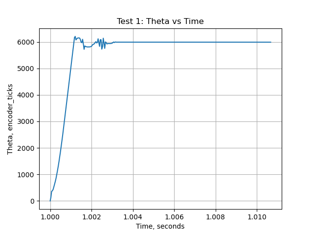
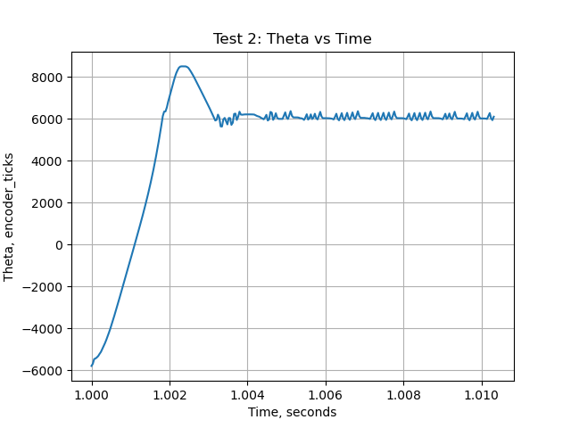
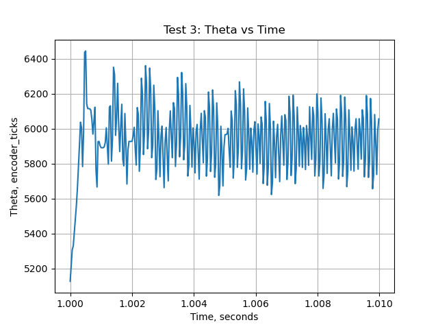

# ME_405_lab2
Lab 2 for ME-405: Motor Control

The purpose of this lab was to develop a closed loop controller that can be used
on a variety of mechanical systems. In this case, a motor and encoder are the primary
components that need closed loop control. With the goal of setting the motors to a specific angle, 
it is critical that a controller in conjunction with an encoder is used to adjust the motor duty cycle.

The proportional controller requires tuning depending on what hardware is used. 
The following plots show differing responses from the system based on altering Kp values.

Test 1 utilizes a Kp of 3 and has a target encoder position of 6000.
This shows how a small gain will prevent overshoot, but it takes longer to 
reach the desired position.

Test 2 utilizes a Kp of 50 and has a target encoder position of 6000.
This shows how a larger Kp will create overshoot. There is no excessive oscillation.

Test 3 utilizes a Kp of 100 and has a target encoder position of 6000.
This shows how a huge Kp will create overshoot and near endless oscillation.